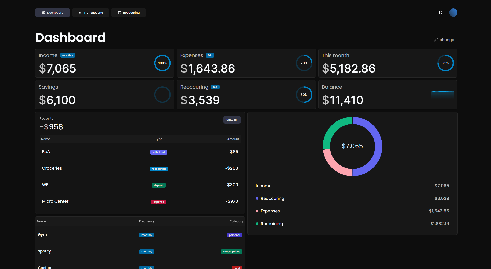
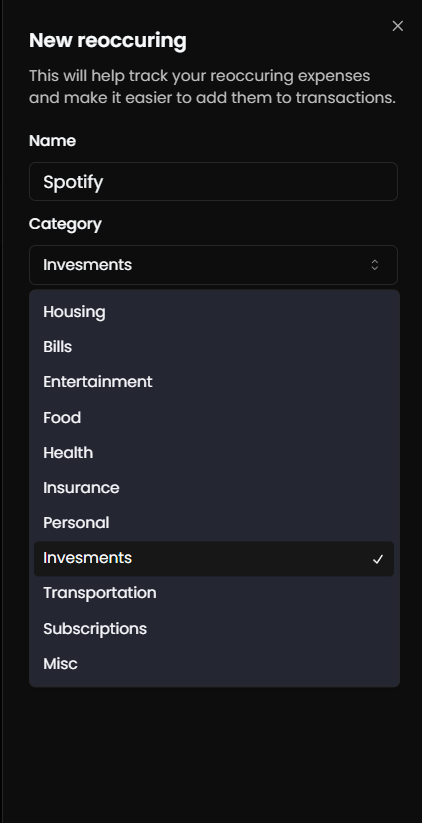
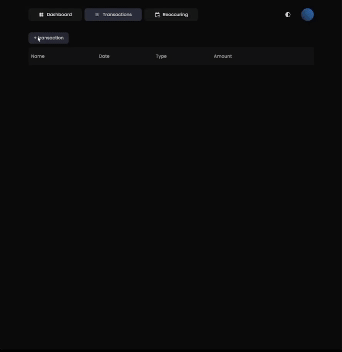
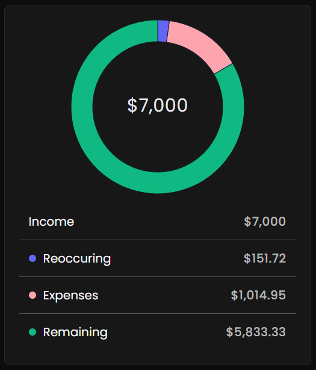
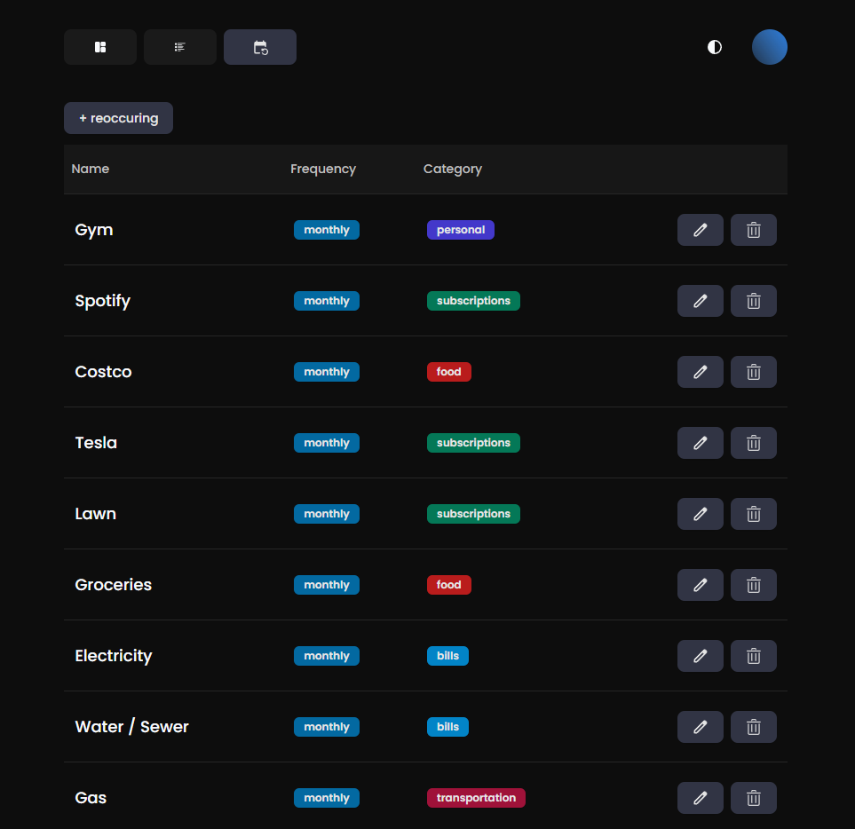

## Overview

Keep track of where your money goes with a clean, minimal dashboard.



## Features

- Add current cashflows (income, savings, balance)
- Manage reoccuring transactions
- Create and manage transactions
- View cashflows
- Chart containing an overview of your monthly cashflow
- Responsive layout
- Dark and light themes

  
  
  
  
  

## Stack


## Getting started

You can either use this project on it's [website](https://pbd.vercel.app) or by spinning up your own server.

### Prerequisites

- [Node.js](https://nodejs.org/)
- [npm](https://www.npmjs.com/)

### Installation

Clone the repository

```shell
git clone https://github.com/sidsurakanti/budgeting-app.git
```

Navigate to the project directory

```shell
cd budgeting-app
```

Install dependencies

```shell
npm install
```

Create a new .env.local file and populate it

```bash
# auth secret used for jwt encoding
# run: openssl rand -base64 32
AUTH_SECRET=""
# refer to @vercel/postgres docs: https://vercel.com/docs/storage/vercel-postgres/quickstart
# you might also need to host this project using vercel if you want to use their db
POSTGRES_URL=""
POSTGRES_PRISMA_URL=""
POSTGRES_URL_NON_POOLING=""
POSTGRES_USER=""
POSTGRES_HOST=""
POSTGRES_PASSWORD=""
POSTGRES_DATABASE=""
```

Start up the server

```shell
npm run dev
```

Your app should now be running on `http://localhost:3000`.

## Contributing

Refer to [CONTRIBUTING.md](./docs/CONTRIBUTING.md)

## Roadmap

- [x] Clean up code
- [ ] Write a better README
- [ ] Track previous paychecks
- [ ] Find APIs from banking or credit card companies to use to automatically get transactions
- [ ] Add other sign in options

## Support

If you need help with anything or want to request new features, you can reach me on [discord](https://discord.com/users/521872289231273994) 👍

## Acknowledgements

Thanks to everyone who assisted me on this project ❤️
