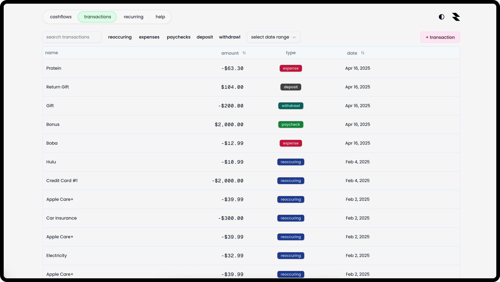

## Overview

Keep track of where your money goes.

<table>
  <tr>
    <td></td>
    <td></td>
  </tr>
  <tr>
    <td></td>
    <td></td>
  </tr>
</table>

## Features

- create and manage income sources
- automatic income tracking
- manage checking and savings balances
- view analytics and charts to see spending habits
- add, update, delete transactions
- search, sort, filter transactions
- set up recurring transactions
- quick add recurring transactions
- google and github sign in

## Stack


## Getting started

You can either use this project on it's [website](https://pbd.vercel.app) or by spinning a seperate instance on your local machine.

### Prerequisites

- [Node.js](https://nodejs.org/)
- [npm](https://www.npmjs.com/)
- [React](https://react.dev/)

### Installation

Clone the repository

```shell
git clone https://github.com/sidsurakanti/finance-analytics-app.git
```

Navigate to the project directory

```zsh
cd finance-analytics-app
```

Install dependencies

```zsh
npm i --legacy-peer-deps # use legacy peer deps b/c some packages don't have support for React 19 yet
```

Create a new .env.local file and populate it

```bash
# auth.js
# just a random string for jwt auth, run: openssl rand -base64 32
AUTH_SECRET=""
# see: https://github.com/settings/developers
# set your callback url as http://[origin]/api/auth/callback/github
AUTH_GITHUB_ID=""
AUTH_GITHUB_SECRET=""
# see: https://console.cloud.google.com/apis/credentials/
AUTH_GOOGLE_ID=""
AUTH_GOOGLE_SECRET=""

# db
# refer to @vercel/postgres docs: https://vercel.com/docs/storage/vercel-postgres/quickstart
POSTGRES_URL=""
POSTGRES_PRISMA_URL=""
POSTGRES_URL_NON_POOLING=""
POSTGRES_USER=""
POSTGRES_HOST=""
POSTGRES_PASSWORD=""
POSTGRES_DATABASE=""
```

Spin up the server

```zsh
npm run dev
```

Your app should now be running on `http://localhost:3000`.

## Awards
Placed #1 FBLA States for Coding and Programming with this project.
Finaled FBLA Finals

## Contributing

Refer to [CONTRIBUTING.md](./docs/CONTRIBUTING.md)

## Roadmap

- [x] Clean up code
- [x] Write a better README
- [ ] Polish the app
- [ ] Look into Plaid's API to auto-fetch transactions from user's credit cards

## Support

If you need help with anything or want to request new features, you can reach me on [discord](https://discord.com/users/521872289231273994) 👍
